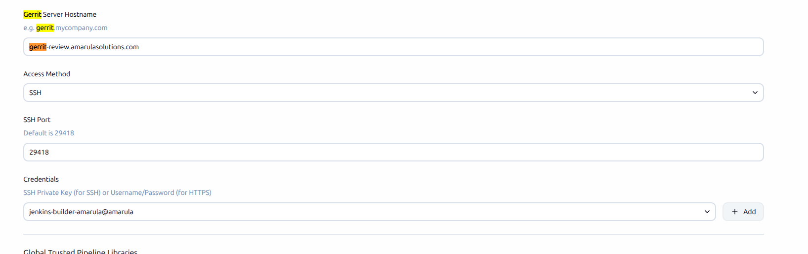

<p align="center">
  
</p>

Pipeline: Gerrit Groovy Libraries
=================================

Allows Pipeline Groovy libraries to be loaded on the fly from public repositories on Gerrit,
private with credentials authentication.
Unlike regular library definitions, no preconfiguration at the global or folder level is needed.

You can configure the plugin from general settings:

<p align="center">
  
</p>

As pipeline example:

```groovy
@Library('@Library('i-tools/ci_jenkins_lib@changes/42/38742/16') _
if (currentBuildExt().hasChangeIn('src')) {
  return
}
node {
  sh 'make'
}
```

[Documentation](https://www.jenkins.io/doc/book/pipeline/shared-libraries/#automatic-shared-libraries)
